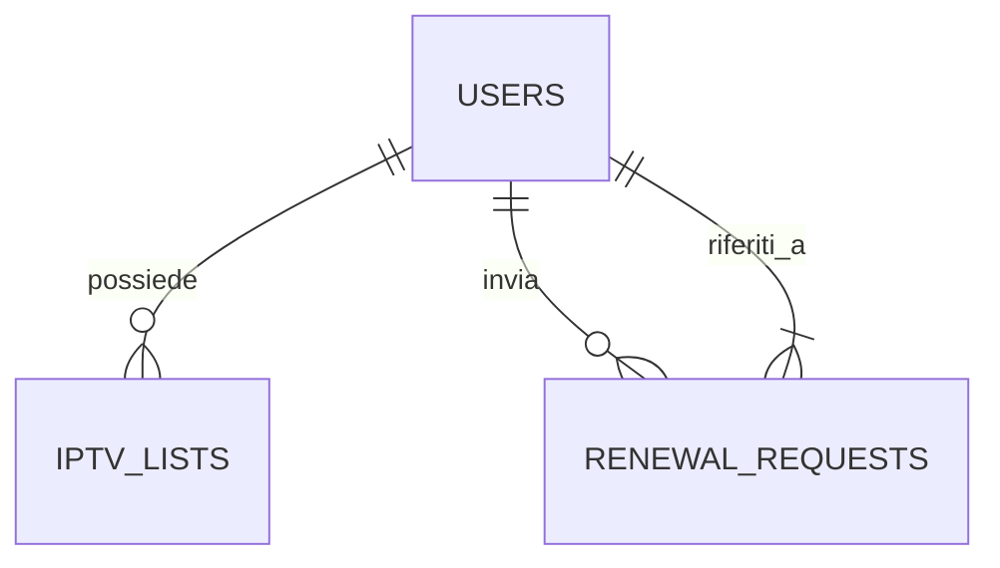
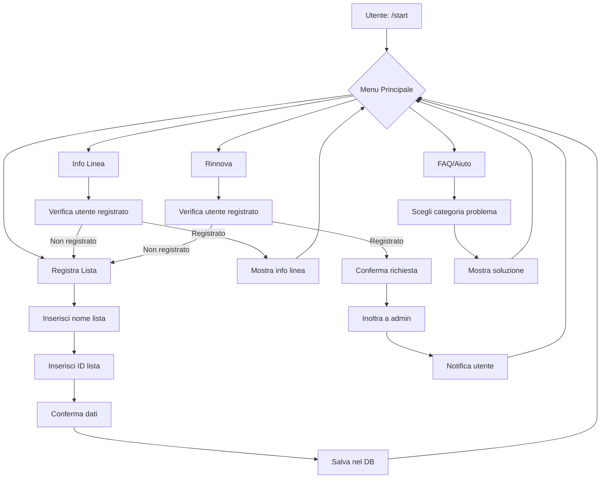
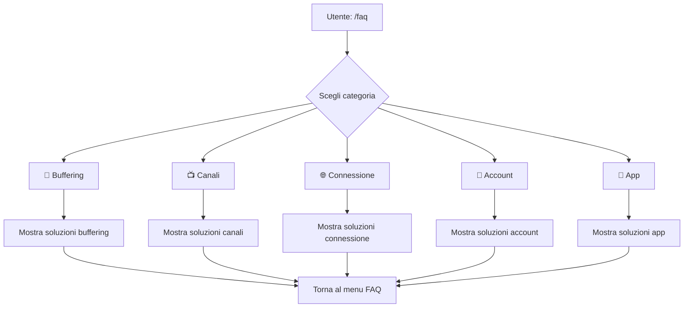

# Specifica Tecnica - Bot Telegram per Gestione Servizio IPTV

## 1. Panoramica del Progetto

### 1.1 Descrizione
Bot Telegram written in Python per la gestione automatizzata di un servizio IPTV. Il sistema permette ai clienti di gestire le proprie liste IPTV, visualizzare lo stato dell'abbonamento, richiedere rinnovi e ottenere supporto automatico per problemi comuni.

### 1.2 Stack Tecnologico
- **Linguaggio**: Python 3.10+
- **Libreria Bot**: [python-telegram-bot](https://github.com/python-telegram-bot/python-telegram-bot) v20+ (API v7)
- **Database**: SQLite3
- **Gestione Configurazione**: python-dotenv + configparser

### 1.3 Requisiti Funzionali
| ID | Requisito | Descrizione |
|----|-----------|-------------|
| RF1 | Identificazione utente | Ogni cliente registra la propria lista IPTV (ID o nome) |
| RF2 | Assistenza automatizzata | FAQ e troubleshooting per problemi comuni |
| RF3 | Info linea | Visualizzazione stato, data scadenza, info abbonamento |
| RF4 | Gestione rinnovi | Richieste inoltrate all'admin per approvazione manuale |
| RF5 | Persistenza dati | Database SQLite per collegare utenti Telegram alle liste IPTV |

---

## 2. Architettura del Bot

### 2.1 Struttura Modulare

```
iptv_bot/
├── config/
│   ├── __init__.py
│   ├── settings.py          # Configurazione centralizzata
│   └── admin_ids.py         # ID admin configurabili
├── database/
│   ├── __init__.py
│   ├── db_manager.py        # Gestione connessioni SQLite
│   ├── user_repository.py  # Operazioni CRUD utenti
│   ├── list_repository.py  # Operazioni CRUD liste IPTV
│   └── renewal_repository.py # Operazioni rinnovi
├── handlers/
│   ├── __init__.py
│   ├── command_handlers.py # Gestione comandi /start, /help, etc.
│   ├── message_handlers.py # Gestione messaggi testuali
│   ├── callback_handlers.py # Gestione callback query (inline buttons)
│   └── admin_handlers.py   # Gestione funzionalità admin
├── keyboards/
│   ├── __init__.py
│   ├── main_menu.py        # Tastiera menu principale
│   ├── faq_keyboards.py    # Tastiere FAQ
│   └── admin_keyboards.py  # Tastiere pannello admin
├── services/
│   ├── __init__.py
│   ├── faq_service.py      # Logica FAQ e troubleshooting
│   ├── renewal_service.py  # Logica gestione rinnovi
│   └── notification_service.py # Notifiche all'admin
├── utils/
│   ├── __init__.py
│   ├── validators.py      # Validazione input utente
│   └── formatters.py       # Formattazione messaggi
├── conversation/
│   ├── __init__.py
│   ├── states.py           # Stati conversazione (enum)
│   └── conversation_handler.py # Gestore conversazioni
├── main.py                 # Entry point del bot
├── bot.py                  # Inizializzazione e setup Application
└── requirements.txt        # Dipendenze Python
```

### 2.2 Pattern Architetturale

Il bot utilizza il pattern **Clean Architecture** con separazione in layer:

```
┌─────────────────────────────────────────────────────────┐
│                    HANDLERS LAYER                        │
│  (Command, Message, Callback - Interfaccia utente)       │
└─────────────────────────────────────────────────────────┘
                            │
                            ▼
┌─────────────────────────────────────────────────────────┐
│                   SERVICES LAYER                         │
│    (Logica di business - FAQ, Rinnovi, Notifiche)        │
└─────────────────────────────────────────────────────────┘
                            │
                            ▼
┌─────────────────────────────────────────────────────────┐
│                 REPOSITORY LAYER                        │
│       (Accesso ai dati - User, List, Renewal)           │
└─────────────────────────────────────────────────────────┘
                            │
                            ▼
┌─────────────────────────────────────────────────────────┐
│                   DATABASE LAYER                        │
│               (SQLite - Persistenza dati)               │
└─────────────────────────────────────────────────────────┘
```

### 2.3 Gestione degli Handler

#### Command Handlers
| Comando | Descrizione | Accesso |
|---------|-------------|---------|
| `/start` | Messaggio di benvenuto e menu principale | Tutti |
| `/help` / `/aiuto` | Mostra lista comandi disponibili | Tutti |
| `/registra` | Avvia procedura registrazione lista | Tutti |
| `/info` | Visualizza info linea e abbonamento | Utenti registrati |
| `/rinnova` | Richiedi rinnovo abbonamento | Utenti registrati |
| `/faq` | Visualizza FAQ e troubleshooting | Tutti |
| `/annulla` | Annulla operazione in corso | Tutti |
| `/admin` | Pannello admin | Solo admin |

#### Callback Query Handlers
| Callback Data | Descrizione |
|---------------|-------------|
| `faq_buffering` | FAQ problema buffering |
| `faq_canali` | FAQ canali non funzionanti |
| `faq_connessione` | FAQ problemi di connessione |
| `info_refresh` | Aggiorna info linea |
| `renewal_confirm` | Conferma richiesta rinnovo (mostrata dopo selezione Rinnova) |
| `renewal_cancel` | Annulla richiesta rinnovo |
| `admin_renewals` | Mostra filtro rinnovi |
| `admin_renewals_list_<status>_<page>` | Pagina lista rinnovi (pendenti/approved/rejected) |
| `admin_renewal_view_<id>_<status>_<page>` | Visualizza dettaglio singola richiesta |
| `admin_approve_<id>_<status>_<page>` | Avvia approvazione (con contesto ritorno) |
| `admin_reject_<id>_<status>_<page>` | Avvia rifiuto (con contesto ritorno) |
| `admin_action_cancel_<status>_<page>` | Annulla workflow admin |
| `admin_panel` / `admin_exit` | Navigazione pannello admin |

#### Message Handlers
| Tipo | Gestione |
|------|----------|
| Testo libero | Validazione e processazione input (nome lista, URL) |
| Inline button callback | Dipende dal callback_data |

---

## 3. Struttura del Database

### 3.1 Schema ER



### 3.2 Tabelle Database

#### Tabella: `users`
Tabella principale per la gestione degli utenti Telegram.

```sql
CREATE TABLE users (
    telegram_id BIGINT PRIMARY KEY,
    username VARCHAR(255) NULL,
    first_name VARCHAR(255) NOT NULL,
    last_name VARCHAR(255) NULL,
    is_registered BOOLEAN DEFAULT FALSE,
    is_admin BOOLEAN DEFAULT FALSE,
    created_at TIMESTAMP DEFAULT CURRENT_TIMESTAMP,
    updated_at TIMESTAMP DEFAULT CURRENT_TIMESTAMP
);
```

| Colonna | Tipo | Descrizione |
|---------|------|-------------|
| `telegram_id` | BIGINT | ID univoco utente Telegram (PK) |
| `username` | VARCHAR | Username Telegram (@username) |
| `first_name` | VARCHAR | Nome visualizzato |
| `last_name` | VARCHAR | Cognome (opzionale) |
| `is_registered` | BOOLEAN | Se l'utente ha registrato una lista |
| `is_admin` | BOOLEAN | Flag admin |
| `created_at` | TIMESTAMP | Data registrazione al bot |
| `updated_at` | TIMESTAMP | Ultimo aggiornamento |

#### Tabella: `iptv_lists`
Tabella per le liste IPTV associate agli utenti.

```sql
CREATE TABLE iptv_lists (
    id INTEGER PRIMARY KEY AUTOINCREMENT,
    user_id BIGINT NOT NULL,
    list_name VARCHAR(255) NOT NULL,
    list_id VARCHAR(255) NULL,
    m3u_url TEXT NULL,
    xmltv_url TEXT NULL,
    expiry_date DATE NULL,
    status VARCHAR(50) DEFAULT 'active',
    notes TEXT NULL,
    created_at TIMESTAMP DEFAULT CURRENT_TIMESTAMP,
    updated_at TIMESTAMP DEFAULT CURRENT_TIMESTAMP,
    FOREIGN KEY (user_id) REFERENCES users(telegram_id)
);
```

| Colonna | Tipo | Descrizione |
|---------|------|-------------|
| `id` | INTEGER | ID auto incrementale (PK) |
| `user_id` | BIGINT | FK a users.telegram_id |
| `list_name` | VARCHAR | Nome identificativo della lista |
| `list_id` | VARCHAR | ID list (se fornito dal provider) |
| `m3u_url` | TEXT | URL playlist M3U |
| `xmltv_url` | TEXT | URL guida XMLTV |
| `expiry_date` | DATE | Data scadenza abbonamento |
| `status` | VARCHAR | Stato: active, expired, suspended |
| `notes` | TEXT | Note interne |
| `created_at` | TIMESTAMP | Data creazione |
| `updated_at` | TIMESTAMP | Ultimo aggiornamento |

#### Tabella: `renewal_requests`
Tabella per le richieste di rinnovo.

```sql
CREATE TABLE renewal_requests (
    id INTEGER PRIMARY KEY AUTOINCREMENT,
    user_id BIGINT NOT NULL,
    list_id INTEGER NULL,
    request_date TIMESTAMP DEFAULT CURRENT_TIMESTAMP,
    status VARCHAR(50) DEFAULT 'pending',
    admin_notes TEXT NULL,
    processed_by BIGINT NULL,
    processed_at TIMESTAMP NULL,
    FOREIGN KEY (user_id) REFERENCES users(telegram_id),
    FOREIGN KEY (list_id) REFERENCES iptv_lists(id)
);
```

| Colonna | Tipo | Descrizione |
|---------|------|-------------|
| `id` | INTEGER | ID richiesta (PK) |
| `user_id` | BIGINT | FK a users.telegram_id |
| `list_id` | INTEGER | FK a iptv_lists.id (opzionale) |
| `request_date` | TIMESTAMP | Data richiesta |
| `status` | VARCHAR | pending, approved, rejected |
| `admin_notes` | TEXT | Note admin (motivo rifiuto) |
| `processed_by` | BIGINT | Admin che ha processato |
| `processed_at` | TIMESTAMP | Data elaborazione |

#### Tabella: `faq_data`
Tabella per le FAQ e troubleshooting.

```sql
CREATE TABLE faq_data (
    id INTEGER PRIMARY KEY AUTOINCREMENT,
    category VARCHAR(100) NOT NULL,
    question TEXT NOT NULL,
    answer TEXT NOT NULL,
    priority INTEGER DEFAULT 0,
    created_at TIMESTAMP DEFAULT CURRENT_TIMESTAMP
);
```

### 3.3 Indici Consigliati

```sql
-- Indice per ricerca utenti per username
CREATE INDEX idx_users_username ON users(username);

-- Indice per ricerca liste per user_id
CREATE INDEX idx_lists_user_id ON iptv_lists(user_id);

-- Indice per ricerca richieste rinnovo per stato
CREATE INDEX idx_renewal_status ON renewal_requests(status);

-- Indice per ricerca richieste rinnovo per user_id
CREATE INDEX idx_renewal_user_id ON renewal_requests(user_id);
```

---

## 4. Flow delle Conversazioni

### 4.1 Diagramma Flow Generale



### 4.2 Flow Registrazione Lista

```
Step 1: /registra
    │
    ▼
Step 2: Bot chiede "Inserisci il nome della tua lista IPTV"
    │
    ▼
Step 3: Utente inserisce nome (es. "Lista Premium Giovanni")
    │
    ▼
Step 4: Bot chiede "Inserisci l'ID della lista (opzionale)"
    │
    ▼
Step 5: Utente inserisce ID (o salta con /annulla)
    │
    ▼
Step 6: Bot chiede "Inserisci la data di scadenza (GG/MM/AAAA)"
    │
    ▼
Step 7: Utente inserisce data (o lascia vuoto)
    │
    ▼
Step 8: Bot mostra riepilogo e conferma
    │
    ▼
Step 9: Utente conferma → Salvataggio DB → Menu principale
```

### 4.3 Flow Richiesta Rinnovo

```
Step 1: /rinnova
    │
    ▼
Step 2: Bot verifica utente registrato
    │
    ├──► Se NON registrato → Richiesta registrazione prima
    │
    └──► Se registrato → Mostra info linea attuale
    │
    ▼
Step 3: Bot chiede "Confermi la richiesta di rinnovo?"
    │
    ▼
Step 4: Utente conferma (button inline)
    │
    ▼
Step 5: Creazione richiesta nel DB (stato: pending)
    │
    ▼
Step 6: Notifica all'admin con pulsanti Approva/Rifiuta
    │
    ▼
Step 7: Admin processa la richiesta
    │
    ├──► Approva → Aggiorna expiry_date → Notifica utente
    │
    └──► Rifiuta → Notifica utente con motivazione
```

### 4.4 Flow Admin - Gestione Rinnovi

```
Step 1: Admin riceve notifica nuova richiesta
    │
    ▼
Step 2: Inline buttons: [Approva] [Rifiuta]
    │
    ├──► Approva
    │       │
    │       ▼
    │   Input: Nuova data scadenza
    │       │
    │       ▼
    │   Aggiorna DB: status=approved
    │       │
    │       ▼
    │   Notifica utente: "Rinnovo approvato!"
    │
    └──► Rifiuta
            │
            ▼
        Input: Motivo rifiuto
            │
            ▼
        Aggiorna DB: status=rejected
            │
            ▼
        Notifica utente: "Rinnovo rifiutato. Motivo: ..."
```

---

## 5. Comandi del Bot

### 5.1 Comandi Pubblici (Utenti)

| Comando | Alias | Descrizione | Parametri |
|---------|-------|-------------|-----------|
| `/start` | - | Messaggio di benvenuto e menu | - |
| `/help` | `/aiuto` | Guida completa ai comandi | - |
| `/registra` | `/addlist` | Registra/modifica lista IPTV | - |
| `/info` | `/stato`, `/linea` | Info linea e scadenza | - |
| `/rinnova` | `/renew` | Richiedi rinnovo abbonamento | - |
| `/faq` | `/problemi` | Mostra FAQ e troubleshooting | [categoria] |
| `/annulla` | `/cancel` | Annulla operazione in corso | - |

### 5.2 Comandi Admin

| Comando | Descrizione | Parametri |
|---------|-------------|-----------|
| `/admin` | Apri pannello admin | - |
| `/admin_utenti` | Lista utenti registrati | [pagina] |
| `/admin_rinnovi` | Lista richieste pendenti | [stato] |
| `/admin_stats` | Statistiche del servizio | - |
| `/admin_broadcast` | Invia messaggio a tutti gli utenti | \<messaggio\> |

### 5.3 Comandi Nascosti (Internali)

| Comando | Descrizione |
|---------|-------------|
| `/admin_approve_{id}` | Approva richiesta rinnovo (callback) |
| `/admin_reject_{id}` | Rifiuta richiesta rinnovo (callback) |

---

## 6. Gestione Admin

### 6.1 Configurazione Admin

Gli ID admin sono configurati in un file separato (non nel DB):

**`config/admin_ids.py`**
```python
# Lista di ID Telegram autorizzati come admin
ADMIN_IDS = [
    123456789,  # Admin principale
    987654321,  # Admin secondario
]

# ID del proprietario/super admin
SUPER_ADMIN_ID = 123456789
```

**`config/settings.py`**
```python
from dataclasses import dataclass
from typing import List

@dataclass
class AdminConfig:
    admin_ids: List[int]
    super_admin_id: int
    
    @classmethod
    def load(cls) -> 'AdminConfig':
        from config.admin_ids import ADMIN_IDS, SUPER_ADMIN_ID
        return cls(admin_ids=ADMIN_IDS, super_admin_id=SUPER_ADMIN_ID)
```

### 6.2 Pannello Admin

Il comando `/admin` mostra una tastiera inline con le opzioni:

```
┌─────────────────────────────────────┐
│         PANELLO ADMIN                │
├─────────────────────────────────────┤
│  📊 Statistiche    👥 Utenti        │
├─────────────────────────────────────┤
│  🔄 Rinnovi        📢 Broadcast     │
├─────────────────────────────────────┤
│  ⚙️ Impostazioni  🔙 Esci           │
└─────────────────────────────────────┘
```

### 6.3 Notifiche Admin

Il bot invia notifiche all'admin per:

| Evento | Messaggio |
|--------|-----------|
| Nuovo utente registrato | "👤 Nuovo utente: {nome} (@{username})" |
| Nuova richiesta rinnovo | "🔄 Rinnovo richiesto da {nome}\nLista: {list_name}\nScadenza: {expiry}" |
| Utente registrato lista | "✅ {nome} ha registrato la lista: {list_name}" |

---

## 7. FAQ e Troubleshooting

### 7.1 Struttura FAQ

Le FAQ sono organizzate per categoria e memorizzate nel database:

| Categoria | Codice | Descrizione |
|-----------|--------|-------------|
| Buffering | `buffering` | Problemi di buffering |
| Canali | `canali` | Canali non funzionanti |
| Connessione | `connessione` | Problemi di connessione |
| Account | `account` | Problemi account/abbonamento |
| Applicazioni | `app` | Problemi con app IPTV |

### 7.2 Contenuti FAQ Standard

#### Categoria: Buffering
- **Problema**: "Il canale fa buffering continuo"
- **Soluzione**:
  1. Verifica la tua connessione internet (minimo 10Mbps)
  2. Prova un altro canale per verificare se è un problema locale
  3. Riavvia l'app/IPTV
  4. Riavvia il dispositivo
  5. Controlla se altri dispositivi nella rete stanno downloadando/streaming
  6. Prova a usare un cavo Ethernet invece del WiFi

#### Categoria: Canali
- **Problema**: "Un canale non funziona"
- **Soluzione**:
  1. Verifica che il canale sia nella tua lista
  2. Prova a fare refresh della lista (esci e rientra)
  3. Controlla se il canale è in manutenzione dal provider
  4. Prova a cercare il canale con un nome diverso

#### Categoria: Connessione
- **Problema**: "Non riesco a connettermi"
- **Soluzione**:
  1. Verifica che la tua lista non sia scaduta (/info)
  2. Controlla le credenziali di accesso
  3. Prova a contattare il supporto se il problema persiste

### 7.3 Implementazione Keyboard FAQ



---

## 8. Gestione Errori e Logging

### 8.1 Strategia di Error Handling

```python
# Struttura gestione errori centralizzata
try:
    # Operazione
except ValidationError as e:
    # Errore di validazione input → Messaggio chiaro all'utente
except DatabaseError as e:
    # Errore DB → Log + Messaggio generico + Notifica admin
except NetworkError as e:
    # Errore di rete → Retry automatico
except Exception as e:
    # Errore non previsto → Log dettagliato + Messaggio generico
```

### 8.2 Livelli di Logging

| Livello | Utilizzo |
|---------|----------|
| DEBUG | Dettagli operazioni (input utente, variabili) |
| INFO | Operazioni normali (utente registrato, comando eseguito) |
| WARNING | Situazioni anomale (input non atteso, retry) |
| ERROR | Errori operativi (DB, network) |
| CRITICAL | Fallimenti critici (bot non funzionante) |

### 8.3 Formato Log

```
2026-02-27 10:30:45 | INFO | user=123456789 | command=/info | status=success
2026-02-27 10:31:02 | ERROR | user=123456789 | command=/registra | error=Database timeout
2026-02-27 10:32:15 | WARNING | user=999999999 | action=unauthorized_admin_access
```

---

## 9. Configurazione e Variabili d'Ambiente

### 9.1 File `.env`

```env
# Configurazione Bot Telegram
TELEGRAM_BOT_TOKEN=1234567890:ABCdefGHIjklMNOpqrsTUVwxyz

# Configurazione Database
DATABASE_PATH=./data/iptv_bot.db

# Configurazione Admin
ADMIN_IDS=123456789,987654321

# Impostazioni Bot
BOT_NAME=IPTV Manager Bot
BOT_VERSION=1.0.0

# Modalità
DEBUG_MODE=False
```

### 9.2 Gestione Configurazione

**`config/settings.py`**
```python
import os
from dataclasses import dataclass
from dotenv import load_dotenv

load_dotenv()

@dataclass
class BotConfig:
    token: str
    database_path: str
    admin_ids: list[int]
    bot_name: str
    debug_mode: bool
    
    @classmethod
    def from_env(cls) -> 'BotConfig':
        admin_ids = os.getenv('ADMIN_IDS', '').split(',')
        admin_ids = [int(x) for x in admin_ids if x]
        
        return cls(
            token=os.getenv('TELEGRAM_BOT_TOKEN'),
            database_path=os.getenv('DATABASE_PATH', './data/iptv_bot.db'),
            admin_ids=admin_ids,
            bot_name=os.getenv('BOT_NAME', 'IPTV Bot'),
            debug_mode=os.getenv('DEBUG_MODE', 'False').lower() == 'true'
        )
```

---

## 10. Dipendenze e Requisiti

### 10.1 File `requirements.txt`

```
python-telegram-bot>=20.0
python-dotenv>=1.0.0
aiosqlite>=0.19.0
SQLAlchemy>=2.0.0
pydantic>=2.0.0
loguru>=0.7.0
```

### 10.2 Installazione

```bash
# Creazione ambiente virtuale
python -m venv venv
source venv/bin/activate  # Linux/Mac
venv\Scripts\activate     # Windows

# Installazione dipendenze
pip install -r requirements.txt

# Setup directory data
mkdir -p data logs

# Avvio bot
python main.py
```

---

## 11. Considerazioni Finali

### 11.1 Scalabilità

- Il bot è progettato per gestire centinaia di utenti
- Per volumi maggiori, considerare migrazione a PostgreSQL
- Utilizzo di `aiosqlite` per operazioni asincrone non bloccanti

### 11.2 Sicurezza

- Token bot mai esposto in codice (solo in variabili d'ambiente)
- Validazione rigorosa input utente
- Protezione comandi admin con check ID
- Sanitizzazione dati per prevenire SQL injection (ORM)

### 11.3 Estensibilità

- Struttura modulare permette aggiunta facilità di nuove funzionalità
- Possibili estensioni future:
  - Integrazione pagamento (Stripe, PayPal)
  - Gestione multi-lingua
  - Statistiche avanzate
  - Backup automatico liste

---

## 12. Milestone Implementative

| # | Milestone | Descrizione |
|---|-----------|-------------|
| 1 | Setup progetto | Creazione struttura, config, main.py |
| 2 | Database | Implementazione schema SQLite |
| 3 | Handlers base | /start, /help, /annulla |
| 4 | Registrazione | Flow completo registrazione lista |
| 5 | Info linea | Visualizzazione stato e scadenza |
| 6 | Rinnovi | Sistema richieste + notifica admin |
| 7 | FAQ | Sistema FAQ con keyboard inline |
| 8 | Admin panel | Funzionalità admin complete |
| 9 | Testing | Test funzionali e edge cases |
| 10 | Deploy | Configurazione produzione |

---

*Documento generato: 2026-02-27*
*Versione: 1.0.0*
